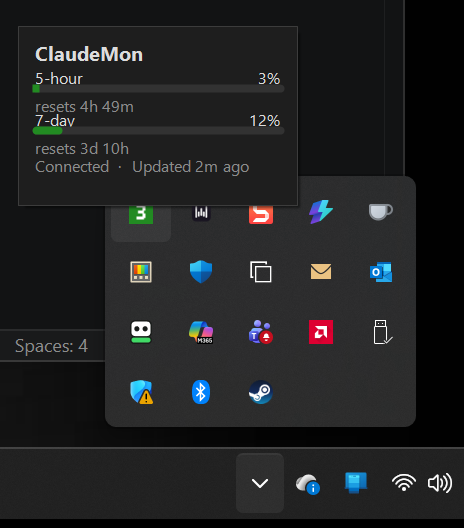
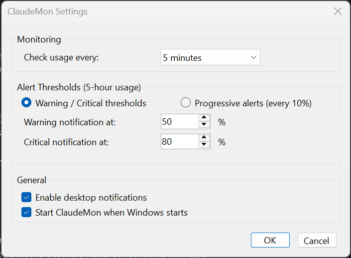

# ClaudeMon

[](https://github.com/badsonstudios/ClaudeMon/actions/workflows/ci.yml)

A Windows system tray application that monitors your Claude AI usage for Claude Max subscribers. It polls the Anthropic API for 5-hour and 7-day rate limit utilization, displays usage as a color-coded tray icon, and sends desktop notifications when approaching limits.



The usage percentage can also be shown directly on the taskbar:


## Features

- **Real-time usage tracking** - Monitors both 5-hour and 7-day usage windows
- **Color-coded tray icon** - Green, yellow, orange, or red based on current utilization
- **Taskbar usage display** - Optional always-visible readout on the taskbar, color-coded to match the tray icon (on by default; toggle in Settings). Choose between two **styles**: the stacked **Numbers** (`5hr · 7day`) or a compact **Bar + time tick** that shows usage against where "now" sits in the reset window (so you can see at a glance whether you're burning faster than the clock), with a selectable bar width. Can also show the 7-day usage alongside the 5-hour one (`5hr / 7day`). Optionally shows on **every** monitor's taskbar (opt-in, when Windows is set to show the taskbar on all displays), and follows monitors as they're connected or disconnected. A position setting lets you fine-tune the spacing from the clock on secondary monitors.
- **Pace-aware alerts** - Rather than a fixed percentage, the main warning fires when your usage relative to how far through the reset window you are means you're **on track to run out before it resets** — early enough to slow down. A separate **near-the-limit backstop** still fires a critical "almost out" alert near the cap regardless of pace, and a **weekly (7-day) warning** covers the longer window. The pace sensitivity (Early / Balanced / Late) is configurable.
- **Reset countdown** - Shows time remaining until rate limits reset
- **Usage trend sparkline** - The flyout draws a compact sparkline of recent 5-hour usage so you can see whether you're climbing fast or leveling off; history is recorded locally and survives restarts
- **Time-to-limit estimate** - When 5-hour usage is rising, the flyout projects how long until you hit 100% at the current rate (e.g. "~35m to limit"); shows "—" when usage is flat/declining or there isn't enough recent history
- **Stays signed in on its own** - When the on-disk access token goes stale (common if you only use the Claude Code VS Code extension), ClaudeMon refreshes it automatically using your saved refresh token, so it keeps showing usage instead of falsely reporting a sign-in problem
- **Sign-in-expired guidance** - When your Claude Code sign-in genuinely can't be refreshed, the tooltip, flyout, and About dialog show a clear "run Claude Code to refresh" message instead of stale usage numbers (the taskbar display shows a neutral "—"); normal display returns automatically after you re-authenticate
- **Update notifications** - Checks GitHub for newer releases (daily and on demand) and links you to the download; toggle in Settings
- **Diagnostic logging** - Writes timestamped diagnostics (poll results, status changes, API/auth/network errors) to a size-bounded log file; a **View logs** tray-menu item opens it. Token values are never written
- **Runs at startup** - Starts with Windows by default (the installer's startup option is pre-checked; you can opt out during setup or later in Settings)

## Installation

Download the latest installer from the [Releases](https://github.com/badsonstudios/ClaudeMon/releases/latest) page.

The installer will optionally configure ClaudeMon to start with Windows.

### Requirements

- Windows 10 or later
- [.NET 10 Desktop Runtime](https://dotnet.microsoft.com/en-us/download/dotnet/10.0)
- An active [Claude Max](https://claude.ai) subscription with Claude Code configured

### Credentials

ClaudeMon reads your existing Claude Code OAuth token from `~/.claude/.credentials.json`. No additional setup is needed if you already use Claude Code. When that token expires, ClaudeMon refreshes it for you using the saved refresh token and writes the renewed token back to the same file (so the CLI and VS Code extension benefit too) — you only need to re-authenticate in Claude Code if the refresh token itself has expired.

### Logs

ClaudeMon writes diagnostics to `%LocalAppData%\ClaudeMon\logs\claudemon.log` (with one rotated backup, `claudemon.log.1`). Open it any time from the tray menu via **View logs**. The log records poll results, status changes, and API/auth/network errors to help diagnose intermittent issues — **token values are never written**.

### Usage history

Recent usage samples are recorded to `%LocalAppData%\ClaudeMon\history.json` to power the flyout's trend sparkline. The file is a rolling window (pruned by age and count, so it never grows without bound) and survives restarts. It contains only utilization percentages and timestamps — no account or token data.

## Settings



Settings are organized into four tabs: **General**, **Alerts**, **Taskbar**, and **Updates**.

### General

| Setting | Description |
|---------|-------------|
| **Start ClaudeMon when Windows starts** | Launch ClaudeMon at login |
| **Check usage every** | Polling interval (1, 3, 5, or 10 minutes) |

### Alerts

| Setting | Description |
|---------|-------------|
| **Enable desktop notifications** | Master toggle for all alerts |
| **Warn when on track to run out** | The pace early-warning — notifies when your usage vs. time elapsed means you'll run out before the 5-hour window resets (on by default) |
| **Sensitivity** | How aggressively the pace warning fires — **Early** (cautious), **Balanced** (default), or **Late** (only when well over pace) |
| **Critical alert near the limit at** | The near-cap backstop — a critical "almost out" alert once 5-hour usage reaches this percentage, regardless of pace (default 90%) |
| **Weekly (7-day) warning at** | Notification when 7-day (weekly) usage crosses this percentage |
| **Notify when the rate limit resets** | Notify when your 5-hour limit resets to full capacity |

### Taskbar

| Setting | Description |
|---------|-------------|
| **Show usage on the Windows taskbar** | Show the usage percentage on the taskbar, next to the clock (on by default) |
| **Style** | Choose how the readout looks: **Numbers** (the stacked label + percentage, default) or **Bar + time tick** (a compact usage bar with hour/day dividers and a "now" tick, pace-coloured) |
| **Bar width** | Width of the bar style — Compact / Standard / Wide / Extra wide. Wider bars give the dividers and time tick more room to read (only applies to the **Bar** style) |
| **Size** | Size of the readout — 75% / 100% / 125% / 150% (100% by default, the standard DPI-scaled size). Handy to shrink the readout on high-scaling displays where it fills the taskbar; enlargement is capped by the taskbar height, so it never clips. Previews live |
| **Also show 7-day usage (5hr / 7day)** | Also display the 7-day percentage next to the 5-hour one, slash-separated (off by default) |
| **Taskbar text colors** | Color of the "Claude" label and the percentage number (presets; the number can stay Auto / usage-level) |
| **Show on secondary monitors** | Also show the readout on secondary monitors' taskbars, not just the primary (off by default; needs Windows set to show the taskbar on all displays) |
| **Position** (under *Show on secondary monitors*) | Nudge the readout left (−) or right (+) on secondary monitors to fine-tune the gap from the clock; previews live as you change it (0 by default). The primary monitor is anchored exactly and isn't affected |

### Updates

| Setting | Description |
|---------|-------------|
| **Check for updates automatically** | Periodically check GitHub for a newer ClaudeMon release and notify you (on by default) |

## Building from Source

```bash
# Clone the repo
git clone https://github.com/badsonstudios/ClaudeMon.git
cd ClaudeMon

# Build
dotnet build

# Run
dotnet run --project src/ClaudeMon

# Run tests
dotnet test
```

### Building the Installer

Requires [Inno Setup 6](https://jrsoftware.org/isdownload.php).

```bash
# Publish and build installer
bash installer/build.sh
```

The installer will be created in the `dist/` folder.

## License

MIT
