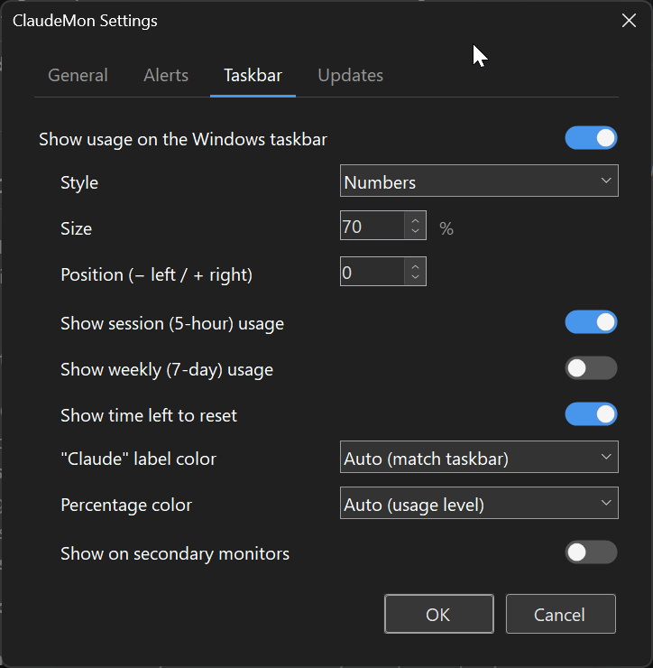

# ClaudeMon

[](https://github.com/badsonstudios/ClaudeMon/actions/workflows/ci.yml)

A Windows system tray application that monitors your Claude AI usage for Claude Max subscribers. It polls the Anthropic API for 5-hour and 7-day rate limit utilization, displays usage as a color-coded tray icon, and sends desktop notifications when approaching limits.


The usage percentage can also be shown directly on the taskbar:


## Features

- **Real-time usage tracking** - Monitors both 5-hour and 7-day usage windows
- **All quota buckets, including per-model weekly caps** - The usage flyout shows one bar for **every** limit the API reports, not just the classic two: Max plans carry a separate weekly cap per model (e.g. "Weekly (Fable)") that can run out **before** the overall weekly, and ClaudeMon now surfaces it with its own percentage, reset countdown, and bar. New bucket types Anthropic adds in the future render automatically with a sensible generic label. The API's own severity judgment tints the bars — a limit flagged *critical* shows red, *warning* at least orange (severity only ever raises urgency, and affects bar color only — alerts and the tray icon are unchanged). The tray tooltip adds a compact line for the tightest per-model weekly (e.g. `Fable wk: 84% (2d 3h)`)
- **Color-coded tray icon** - Green, yellow, orange, or red based on current utilization
- **Taskbar usage display** - Optional always-visible readout on the taskbar, color-coded to match the tray icon (on by default; toggle in Settings). Choose between two **styles**: the stacked **Numbers** or a compact **Bar + time tick** that shows usage against where "now" sits in the reset window (so you can see at a glance whether you're burning faster than the clock), with a selectable bar width. Compose what it shows with three toggles — **session (5-hour) usage**, **weekly (7-day) usage**, and a live **time-left-to-reset countdown** (e.g. `1h 23m`, Numbers style; shows `idle` when the 5-hour window has ended and no new one has started). An optional **% sign** setting renders the percentages as `42% · 17%` instead of the compact default `42 · 17`. Optionally shows on **every** monitor's taskbar (opt-in, when Windows is set to show the taskbar on all displays), and follows monitors as they're connected or disconnected. A position setting lets you fine-tune the spacing from the clock on secondary monitors. While no usage reading is available yet (just launched, or the API is rate limited before anything was fetched) the readout shows a waiting "…" under the "Claude" label instead of nothing, and switches to real numbers on the next successful poll.
- **Pace-aware alerts** - Rather than a fixed percentage, the main warning fires when your usage relative to how far through the reset window you are means you're **on track to run out before it resets** — early enough to slow down. A separate **near-the-limit backstop** still fires a critical "almost out" alert near the cap regardless of pace, and a **weekly (7-day) warning** covers the longer window. The pace sensitivity (Early / Balanced / Late) is configurable. When you're deliberately burning quota, **Snooze notifications** in the tray menu quiets the alerts for 30 minutes / 1 hour / 3 hours / until the next 5-hour reset — the tray and taskbar readouts keep updating, the menu shows the remaining snooze time with a **Resume alerts** item, the snooze survives a restart, and an alert whose condition still holds when the snooze ends fires then instead of being lost.
- **Reset countdown** - Shows time remaining until rate limits reset
- **Smart polling while locked** - Pauses API polling (and the daily update check) while the workstation is locked, then refreshes immediately on unlock so the readout is fresh within seconds of returning — no wasted API calls overnight, no stale numbers when you sit back down
- **Usage trend sparkline** - The flyout draws a compact sparkline of recent 5-hour usage so you can see whether you're climbing fast or leveling off; history is recorded locally and survives restarts
- **Time-to-limit estimate** - When 5-hour usage is rising, the flyout projects how long until you hit 100% at the current rate (e.g. "~35m to limit"); shows "—" when usage is flat/declining or there isn't enough recent history
- **Stays signed in on its own** - When the on-disk access token goes stale (common if you only use the Claude Code VS Code extension), ClaudeMon refreshes it automatically using your saved refresh token, so it keeps showing usage instead of falsely reporting a sign-in problem
- **Sign-in-expired guidance** - When your Claude Code sign-in genuinely can't be refreshed, the tooltip, flyout, and About dialog show a clear "run Claude Code to refresh" message instead of stale usage numbers (the taskbar display shows a neutral "—"); normal display returns automatically after you re-authenticate
- **In-app updates** - Checks GitHub for newer releases (daily and on demand); a small in-app window offers **Get the update**, **Ignore**, or **Skip this version**, with a **View release notes** link so you can see what changed before deciding. **Get the update** downloads the installer in-app, verifies it (SHA-256), and installs it silently — no installer wizard, no SmartScreen popup — then relaunches on the new version. An optional **Install updates automatically** setting does the whole thing hands-free
- **Diagnostic logging** - Writes timestamped diagnostics (poll results, status changes, API/auth/network errors) to a per-day log file, keeping the last 7 days; a **View logs** tray-menu item opens the latest one. Token values are never written
- **Runs at startup** - Starts with Windows by default (the installer's startup option is pre-checked; you can opt out during setup or later in Settings)

## Installation

Download the latest installer from the [Releases](https://github.com/badsonstudios/ClaudeMon/releases/latest) page.

The installer will optionally configure ClaudeMon to start with Windows.

### Requirements

- Windows 10 or later
- [.NET 10 Desktop Runtime](https://dotnet.microsoft.com/en-us/download/dotnet/10.0)
- An active [Claude Max](https://claude.ai) subscription with Claude Code configured

### Credentials

ClaudeMon reads your existing Claude Code OAuth token from `~/.claude/.credentials.json`. No additional setup is needed if you already use Claude Code. When that token expires, ClaudeMon refreshes it for you using the saved refresh token and writes the renewed token back to the same file (so the CLI and VS Code extension benefit too) — you only need to re-authenticate in Claude Code if the refresh token itself has expired.

### Logs

ClaudeMon writes diagnostics to a per-day file, `%LocalAppData%\ClaudeMon\logs\claudemon-YYYY-MM-DD.log`; files older than 7 days (including any logs from versions before daily files) are deleted automatically. Open the latest one any time from the tray menu via **View logs**. The log records poll results, status changes, and API/auth/network errors to help diagnose intermittent issues — **token values are never written**.

### Usage history

Recent usage samples are recorded to `%LocalAppData%\ClaudeMon\history.json` to power the flyout's trend sparkline. The file is a rolling window (pruned by age and count, so it never grows without bound) and survives restarts. It contains only utilization percentages and timestamps — no account or token data.

## Settings

Settings are organized into four tabs: **General**, **Alerts**, **Taskbar**, and **Updates**.

### General

| Setting | Description |
|---------|-------------|
| **Start ClaudeMon when Windows starts** | Launch ClaudeMon at login |
| **Check usage every** | Polling interval (2, 3, 5, or 10 minutes) |

### Alerts


| Setting | Description |
|---------|-------------|
| **Enable desktop notifications** | Master toggle for all alerts |
| **Warn when on track to run out** | The pace early-warning — notifies when your usage vs. time elapsed means you'll run out before the 5-hour window resets (on by default) |
| **Sensitivity** | How aggressively the pace warning fires — **Early** (cautious), **Balanced** (default), or **Late** (only when well over pace) |
| **Critical alert near the limit at** | The near-cap backstop — a critical "almost out" alert once 5-hour usage reaches this percentage, regardless of pace (default 90%) |
| **Weekly (7-day) warning at** | Notification when 7-day (weekly) usage crosses this percentage |
| **Notify when the rate limit resets** | Notify when your 5-hour limit resets to full capacity |

### Taskbar



| Setting | Description |
|---------|-------------|
| **Show usage on the Windows taskbar** | Show the usage percentage on the taskbar, next to the clock (on by default) |
| **Style** | Choose how the readout looks: **Numbers** (the stacked label + percentage, default) or **Bar + time tick** (a compact usage bar with hour/day dividers and a "now" tick, pace-coloured) |
| **Bar width** | Width of the bar style — Compact / Standard / Wide / Extra wide. Wider bars give the dividers and time tick more room to read (only applies to the **Bar** style) |
| **Size** | Size of the readout as a percentage — any value from 25% to 150% (100% by default, the standard DPI-scaled size; arrow keys step by 5). Handy to shrink the readout on high-scaling displays where it fills the taskbar; enlargement is capped by the taskbar height, so it never clips. Previews live |
| **Position** | Nudge the primary monitor's readout left (−) or right (+) in pixels — e.g. to open more gap from the clock or clear something near the tray; previews live as you change it. 0 (the default) keeps the exact tray anchoring, so nothing moves until you adjust it |
| **Show session (5-hour) usage** | Show the session percentage in the readout (on by default) |
| **Show weekly (7-day) usage** | Also show the weekly percentage, dot-separated (off by default; replaces the old "Also show 7-day usage" toggle — an existing opt-in migrates automatically) |
| **Show time left to reset** | Add a compact countdown to the 5-hour reset (e.g. `1h 23m`) that ticks down live. Numbers style only — the Bar style already marks time with its tick (off by default) |
| **Show % sign after percentages** | Render the readout's percentages with an explicit percent sign (`42% · 17%` instead of `42 · 17`). Numbers style only (off by default, keeping the compact original look) |
| **Taskbar text colors** | Color of the "Claude" label and the percentage number. Fixed presets, plus **Auto (match taskbar)** — light text on a dark taskbar, dark on a light one, following theme changes live; the number can also stay **Auto (usage level)** (green/yellow/orange/red) |
| **Show on secondary monitors** | Also show the readout on secondary monitors' taskbars, not just the primary (off by default; needs Windows set to show the taskbar on all displays) |
| **Secondary position** (under *Show on secondary monitors*) | Nudge the readout left (−) or right (+) on secondary monitors to fine-tune the gap from the clock; previews live as you change it (0 by default). Independent of the primary **Position** nudge |

### Updates

| Setting | Description |
|---------|-------------|
| **Check for updates automatically** | Periodically check GitHub for a newer ClaudeMon release and offer it in the update window (on by default). Skipped versions stay quiet until something newer ships; a manual **Check for updates** from the tray menu always asks |
| **Install updates automatically** (under *Check for updates*) | When the automatic check finds a newer release, download and install it silently — no prompts, no wizard — and relaunch on the new version, with a tray notification afterward (off by default). Your **run at Windows startup** choice is always preserved across updates |

## Building from Source

```bash
# Clone the repo
git clone https://github.com/badsonstudios/ClaudeMon.git
cd ClaudeMon

# Build
dotnet build

# Run
dotnet run --project src/ClaudeMon

# Run tests
dotnet test
```

### Building the Installer

Requires [Inno Setup 6](https://jrsoftware.org/isdownload.php).

```bash
# Publish and build installer
bash installer/build.sh
```

The installer will be created in the `dist/` folder.

## License

MIT
